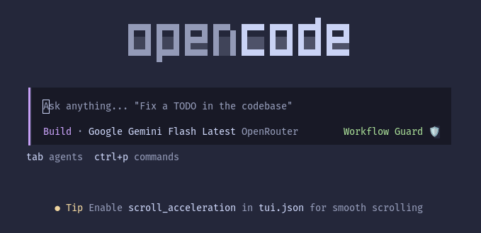

# OpenCode Workflow Guard

[](https://www.npmjs.com/package/opencode-workflow-guard)
[](https://opensource.org/licenses/MIT)
[](test/test.mts)

Deterministic policy and enforcement layer for OpenCode. Workflow Guard enforces workflow and safety invariants through **hard plugin hooks**, not prompt instructions that LLMs can ignore.

Workflow Guard is deliberately **not an agent harness**: it can constrain actions, record and explain decisions, and supply bounded context, but it does not plan, prioritize, delegate, or autonomously sequence the agent's work. Bounded continuation may resume an existing session with unfinished owned todos; it never chooses the next task or creates new work.

---

## Quick Start

### 1. Installation

Install the current published version globally with OpenCode's plugin installer:

```bash
VERSION=$(npm view opencode-workflow-guard version)
opencode plugin "opencode-workflow-guard@$VERSION" --global --force
```

*Requires OpenCode >= 1.18.* OpenCode detects the package's server and TUI targets and updates both global configs. Use the same command after a release to upgrade; the explicit version gives OpenCode a fresh package-cache key. Restart OpenCode after installation. See [docs/installation.md](docs/installation.md) for details and links to the OpenCode plugin documentation.

For the optional TUI badge, configure `"opencode-workflow-guard"` in `tui.json`. OpenCode resolves the package's exported `./tui` entrypoint automatically for TUI plugins. The companion shows a `Workflow Guard` shield in the prompt bar and reflects blocked state without changing agent behavior. Do not place the TUI module under the server `plugins/` directory.



### 2. Verification

```bash
npm run typecheck    # Strict TypeScript check (0 errors)
npm test             # Run 415+ unit and adversarial tests
npm run test:all     # Typecheck + unit + install/load checks
WORKFLOW_GUARD_LIVE_E2E=1 npm run test:install # Also run policy probes with OpenCode's most recently selected model
```

---

## Core Guardrails Overview

The plugin enforces **24 deterministic policy rules** across four main pillars:

* **Branch & History Protection:** Enforces feature-branch workflows (blocks edits/commits on `main`/`master`), hard-blocks direct or forced pushes to protected branches, enforces mergeability pre-flight checks, and requires PR changelogs / changesets.
* **Task & Verification Discipline:** Gates file mutations on active `todowrite` tasks with subagent inheritance, blocks concurrent direct edits to the same canonical file across sessions, requires same-session fresh reads before `edit`/`write` can replace existing files, blocks silent task deletion, enforces fresh test verification evidence before task completion, and journals completion claims vs. verification mismatches.
* **Secrets & Workspace Confinement:** Confines edit tools and recognized shell/git mutations within the workspace root (including symlink and `../` escape checks), scrubs sensitive environment variables in agent subshells, and redacts `.env` reads with safe schema masks. Arbitrary executables are not OS-sandboxed; use containers or filesystem isolation when hard confinement is required.
* **Destructive CLI & Environment Safety:** Intercepts destructive cloud/database/infrastructure commands, stops script laundering and interpreter evasion, blocks TTY hangs (`vim`, `nano`, `sudo`), and guards against dangerous package manager flags.

For complete policy specifications and override rules, see [docs/policies.md](docs/policies.md).

---

## Documentation Index

| Guide | Description |
|---|---|
| [**Policy Reference**](docs/policies.md) | Comprehensive specification of all 24 enforced policies, invariants, and override semantics |
| [**Installation & Configuration**](docs/installation.md) | Setup options, global vs. local install, worktree isolation, and project configuration |
| [**Managed Deployment**](docs/managed-deployment.md) | Administrator-managed OpenCode policy, platform locations, and startup diagnostics |
| [**Troubleshooting**](docs/troubleshooting.md) | Diagnosing policy blocks, common false positives, and emergency override procedures |
| [**Testing Architecture**](docs/testing.md) | Test harness design, adversarial regression matrix, and CI verification |
| [**Contributing Guide**](CONTRIBUTING.md) | Development workflow, coding conventions, test requirements, and changeset PR rules |
| [**Security Policy**](SECURITY.md) | Vulnerability disclosure policy and threat model |

---

## License

[MIT](LICENSE)
